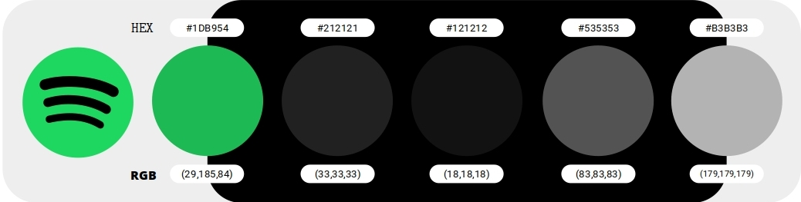

## 👋 Hello!  
I received a Master’s degree in Mechatronics Engineering from Modelo University, and a doctorate in Bioengineering and Robotics, Advanced Robotics Curriculum and Humanoids from University of Genova (UniGe).  
I was a professor and coordinator of the Mechatronics Engineering programme at Modelo University and an academic director of the Yucatán Robotics Institute (TRIY).  
Now, I work at the Wearable Robots, Exoskeletons, and Exosuits Laboratory (XoLab) of the Advanced Robotics Department (ADVR) at the Istituto Italiano di Tecnologia (IIT), developing digital user interfaces for industrial exoskeletons.  
These devices help workers stay healthy in their workplaces.

---

## 👤 About me  
🇲🇽 I'm from Mexico  
💻 I love Programming  
👩‍💻 My favorite programming language is C  
🖥️ I like embedded systems such as Arduino and Raspberry Pi  
🧱 I used to work with FPGAs
📡 I have launched a HAB (High Altitutde Baloon) once
🤖 I'm a roboticist  
🏖️ Traveling is one of my favorite hobbies, South Asia is my favorite region  
🎸 I already played in a band when I was a teenager, I played the bass!

---

## 📄 Publications  
📄 O. A. Moreno F., R. Parameswari, C. Di Natali, J. Ortiz, and D. G. Caldwell, “Task Assessment of XoNLI: A Natural Language Interface for Occupational Exoskeletons,” in *2024 10th IEEE RAS/EMBS International Conference for Biomedical Robotics and Biomechatronics (BioRob)*, Sep. 2024, pp. 634–640. doi: [10.1109/BioRob60516.2024.10719829](https://doi.org/10.1109/BioRob60516.2024.10719829)  
📄 O. A. Moreno F., R. Parameswari, C. Di Natali, D. G. Caldwell, and J. Ortiz, “Assessment and Benchmarking of XoNLI: a Natural Language Processing Interface for Industrial Exoskeletons,” in *2024 IEEE International Conference on Robotics and Automation (ICRA)*, May 2024, pp. 3333–3340. doi: [10.1109/ICRA57147.2024.10610451](https://doi.org/10.1109/ICRA57147.2024.10610451)  
📄 O. A. Moreno F., C. Di Natali, L. Monica, F. Draicchio, D. G. Caldwell, and J. Ortiz, “Assessment of the Monitor System Interface: A Setup System Tool for Industrial Exoskeletons,” in *2023 9th International HCI and UX Conference in Indonesia (CHIuXiD)*, Nov. 2023, pp. 47–52. doi: [10.1109/CHIuXiD59550.2023.10452744](https://doi.org/10.1109/CHIuXiD59550.2023.10452744)  
📄 O. A. Moreno F., D. Park, C. Di Natali, D. G. Caldwell, and J. Ortiz, “Integration and Task Assessment of the User Command Interface to the Occupational Exoskeleton Shoulder-sideWINDER,” in *2024 IEEE/SICE International Symposium on System Integration (SII)*, Jan. 2024, pp. 1176–1182. doi: [10.1109/SII58957.2024.10417173](https://doi.org/10.1109/SII58957.2024.10417173)  
📄 O. A. Moreno F. et al., “Evaluating Ergonomic Design: A User Command Interface for Industrial Exoskeletons,” in *Human Interaction and Emerging Technologies (IHIET 2024)*, AHFE Open Access, 2024. doi: [10.54941/ahfe1005497](https://doi.org/10.54941/ahfe1005497)  
📄 O. A. Moreno Franco, D. Park, C. Di Natali, D. G. Caldwell, and J. Ortiz, “Evaluation of Visual and Audio Notifications in the User Command Interface Integrated with the Industrial Exoskeleton Shoulder-sideWINDER,” in *2023 IEEE International Conference on Robotics and Biomimetics (ROBIO)*, Dec. 2023, pp. 1–7. doi: [10.1109/ROBIO58561.2023.10354678](https://doi.org/10.1109/ROBIO58561.2023.10354678)  
📄 O. A. Moreno F. et al., “Design and Evaluation of A Wearable Adaptable Setup System for Occupational Exoskeletons,” in *Human Interaction & Emerging Technologies (IHIET 2023): Artificial Intelligence & Future Applications*, AHFE Open Access, 2023. doi: [10.54941/ahfe1004009](https://doi.org/10.54941/ahfe1004009)  
📄 O. A. Moreno Franco, J. Ortiz, and D. G. Caldwell, “Evaluation of the User Command Interface, an Adaptable Setup System for Industrial Exoskeletons,” in *2022 9th IEEE RAS/EMBS International Conference for Biomedical Robotics and Biomechatronics (BioRob)*, Aug. 2022, pp. 01–07. doi: [10.1109/BioRob52689.2022.9925438](https://doi.org/10.1109/BioRob52689.2022.9925438)  
📄 O. A. Moreno, F. Draicchio, L. Monica, S. Anastasi, D. G. Caldwell, and J. Ortiz, “Designing an Integrated Tool Set Framework for Industrial Exoskeletons,” in *Wearable Robotics: Challenges and Trends*, in Biosystems & Biorobotics. Springer, 2022, pp. 583–588. doi: [10.1007/978-3-030-69547-7_94](https://doi.org/10.1007/978-3-030-69547-7_94)  
📄 G. Bianchini, J. Bimbo, C. Pacchierotti, D. Prattichizzo, and O. A. Moreno, “Transparency-oriented passivity control design for haptic-enabled teleoperation systems with multiple degrees of freedom,” in *2018 IEEE Conference on Decision and Control (CDC)*, Dec. 2018, pp. 2011–2016. doi: [10.1109/CDC.2018.8618970](https://doi.org/10.1109/CDC.2018.8618970)  
📄 O. A. Moreno Franco, J. Bimbo, C. Pacchierotti, D. Prattichizzo, D. Barcelli, and G. Bianchini, “Transparency-Optimal Passivity Layer Design for Time-Domain Control of Multi-DoF Haptic-Enabled Teleoperation,” in *2018 IEEE/RSJ International Conference on Intelligent Robots and Systems (IROS)*, Oct. 2018, pp. 4988–4994. doi: [10.1109/IROS.2018.8593443](https://doi.org/10.1109/IROS.2018.8593443)

---

## 🎯 Hobbies  
🌮 I love Mexican food  
💵 I like to collect banknotes and stamps

---

## 🎨 UI/UX

👍 I like Spotify color palette:

